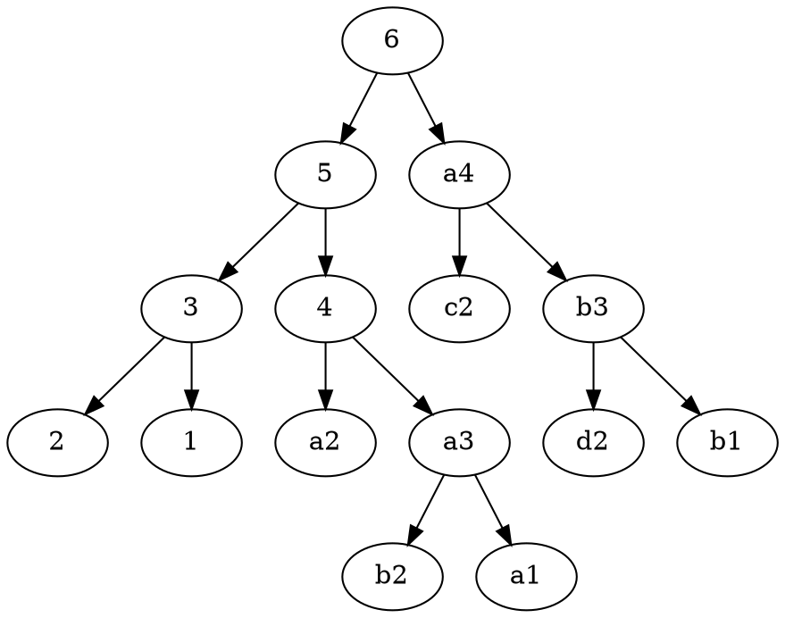
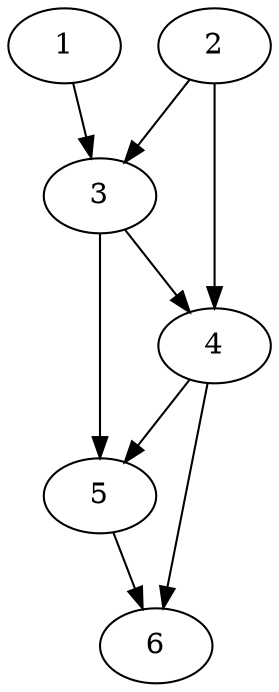

## 每日一题 - 爬楼梯

### 信息卡片

- 时间：2022-04-11
- 题目链接：https://leetcode-cn.com/problems/climbing-stairs/
- tag：`记忆化搜索` `数学` `动态规划`


### 题目描述

假设你正在爬楼梯。需要 `n` 阶你才能到达楼顶。
每次你可以爬 `1` 或 `2` 个台阶。你有多少种不同的方法可以爬到楼顶呢？

**示例1：**
```
输入：n = 2
输出：2
解释：有两种方法可以爬到楼顶。
1. 1 阶 + 1 阶
2. 2 阶
```

**示例2：**
```
输入：n = 3
输出：3
解释：有三种方法可以爬到楼顶。
1. 1 阶 + 1 阶 + 1 阶
2. 1 阶 + 2 阶
3. 2 阶 + 1 阶
```

**提示：**`1 <= n <= 45`

### 思路分析

1. 一次走 __1个台阶__ | 一次走 __2个台阶__
2. 假设n个台阶：
    - 先走1个，剩下的n-1个如何走
    - 先走2个，剩下的n-2个如何走
3. 归纳 1、2，用公式表示：
  $f(n) = f(n-1) + f(n-2), \text{ n>3 }$
4. 可以看出是递归公式 → 递归则要想到两部分(终止条件、递归条件)：
    - 终止条件：
      + 走到顶部，只有1个台阶时 f(1) = 1
      + $f(2) = f(1) + f(0)$ 
        2 = 1 + (1?) 
        f(0) = 1? 明显与事实不符
        $f(2) = 2$ 也作为终止条件

5. 综上：
  $f(n) = \begin{cases} 1, \text{ n=1 } \\ 2, \text{ n=2 } \\ f(n-1) + f(n-2), \text{ n>3 } \end{cases}$

### 参考答案

#### 1. 递归解法 $O(n^2)$

```javascript {.line-numbers}
function climbStairsWithRecursive(n) {
  if (n === 1) return 1
  if (n === 2) return 2
  return climbStairsWithRecursive(n - 1) + climbStairsWithRecursive(n - 2)
} 
```

存在重复计算的问题

> 例如求f(6)，必须求f(5)+f(4)，求f(5)，就要求f(4)+f(3)；明显f(4)就重复计算了

#### 2. 使用 hashMap 存储求解值 $O(n)$

避免1中的重复计算

```javascript {.line-numbers}
function climbStairs(n, map = new Map()) {
  if (n === 1) return 1
  if (n === 2) return 2
  if (map.get(n) !== undefined) {
    return map.get(n)
  } else {
    const result = climbStairs(n - 1, map) + climbStairs(n - 2, map)
    map.set(n, result)
    return result
  }
}
```

#### 3. 循环，自底向上累加




1. 上一个循环解再下一个求解中需要用到
2. 需要额外的2个变量存储其子问题的结果

```javascript {.line-numbers}
function climbStairsWithLoop(n) {
  if (n === 1) return 1
  if (n === 2) return 2
  let result = 0
  let pre = 2
  let prePre = 1
  for(let i = 3; i <= n; ++i) {
    result = pre + prePre
    prePre = pre
    pre = result
  }
  return result
}
```

### 扩展

斐波那契数列（Fibonacci）
$f(n) = \begin{cases} 0, \text{ n=0 } \\ 1, \text{ n=1 } \\ f(n-2) + f(n-1), \text{ n>1 } \end{cases}$

求斐波那契数列的第n项：
上面的三种方法都可求解

```javascript
function Fibonacci(n) {
  if (n === 0) return 0
  if (n === 1) return 1
  let result = 0
  let pre = 0
  let prePre = 1
  for(let i = 2; i <= n; ++i) {
    result = prePre + pre
    prePre = pre
    pre = result
  }
  return result
}
```

循环 + 解构赋值
```javascript {.line-numbers}
var fibonacci = function (n) {
  let n1 = 0
  let n2 = 1
  for (let i = 2; i <= n; i++) {
    [n1, n2] = [n2, n1 + n2]
  }
  return n2
}
```